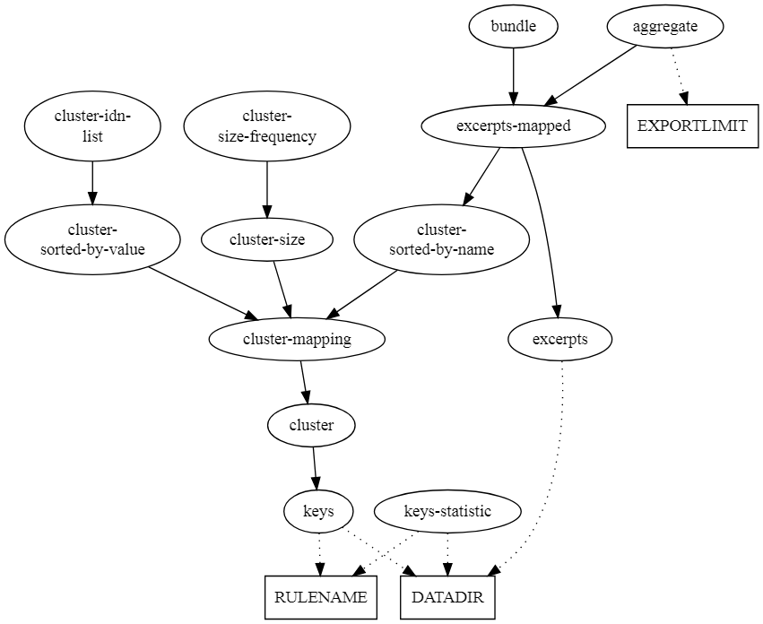

# Culturegraph Workflows

## Description

Implementation of the record linkage routines used for the [culturegraph project](http://www.dnb.de/DE/Wir/Projekte/Abgeschlossen/culturegraph.html).

The project aims to group similar bibliographic records that describe the same
concept (manifestation, work etc.) defined by FRBR
(Functional Requirements for Bibliographic Records).

## Install

### Requirements

* GNU Make
* Java 8

## Syntax

```
make TARGET [PARAMETER ...]
```

Examples:

```bash
# Show help
make help
```

```bash
# Compute keys
make keys RULENAME=wrk DATADIR=/opt/data
```

```bash
# Compute keys-statistic
make keys-statistic RULENAME=wrk DATADIR=/opt/data
```

```bash
# Compute cluster (sorted by name)
make cluster-sorted-by-name RULENAME=wrk DATADIR=/opt/data
```

```bash
# Compute idn-list
make cluster-idn-list RULENAME=wrk DATADIR=/opt/data
```

```bash
# Build XML with bundles excerpts
make bundle RULENAME=wrk DATADIR=/opt/data
```

## Options

Each target creates a file or runs multiple dependencies.

| Target | Description |
| --- | --- |
| all | Build all possible targets. |
| keys | Constructs (match-)keys for each record. |
| cluster | Maps related records into clusters. |
| bundle | Constructs a XML file that contains grouped MARCXML excerpts according to the computed clustering. |
| solr | Constructs a XML file that contains index updates for Apache Solr. One file contains documents, the other contains document updates with cluster tags. |


There are also the following targets available:

| Target | Description |
| --- | --- |
| cluster-idn-list | Build a file that collects the ids for each cluster. One cluster per line. |
| cluster-size | Builds a table that contains the cluster number and the corresponding cluster size. |
| cluster-size-frequency | Builds a table that contains the cluster size and the corresponding frequency. |
| cluster-sorted-by-name | Clustering sorted by the record id column. |
| cluster-sorted-by-value | Clustering sorted by the cluster number column. |
| excerpts | Build a file that contains a MARC21 excerpt for each bibliographic record. |
| excerpts-mapped | Annotates each excerpt with the corresponding cluster number for each record (sorted by clustering). |
| keys-statistic | A table that shows the distribution for each key type related to the agency that provided the record. |

Parameter table:

| Parameter | Description |
| --- | --- |
| DATADIR | Directory that contains bibliographic records <br> (Format: `Marc21` or `MARC-XML`, Compression: `gz`). |
| JVM_OPTS | JVM options passed to each java processes call <br> (Default: `-Dfile.encoding=UTF-8 -Xmx2g`). |
| JVM_HEAVY_TASK | JVM options for tasks that need a lot of resources <br> (Default: `-Xmx12g -XX:+UseCompressedOops -XX:+UseG1GC`).
| RULENAME | Rule set for key generation <br> (Choose: [`wrk`], Default: `wrk`). |
| TARGETDIR |  Directory that contains build results <br> (Default: `./target`). |

## Appendix

## Makefile Graph



Use [GraphvizOnline](https://dreampuf.github.io/GraphvizOnline/)
with the following graph:

```GraphViz
digraph Makefile {

    datadir [
        label = DATADIR
        shape = rect
    ]
    
    rulename [
        label = RULENAME
        shape = rect
    ]
    
    keys_statistic [ label = "keys-statistic" ]
    cluster_sorted_by_name [ label = "cluster-\nsorted-by-name" ]
    cluster_sorted_by_value [ label = "cluster-\nsorted-by-value" ]
    cluster_idn_list [ label = "cluster-idn-\nlist" ]
    cluster_size [ label = "cluster-size"]
    cluster_size_frequencey [ label = "cluster-\nsize-frequency" ]
    excerpts_mapped [ label = "excerpts-mapped" ]

    keys -> datadir [ style = dotted ]
    keys -> rulename [ style = dotted ]
    keys_statistic -> datadir [ style = dotted ]
    keys_statistic -> rulename [ style = dotted ]

    cluster -> keys
    cluster_sorted_by_name -> cluster
    cluster_sorted_by_value -> cluster
    cluster_idn_list -> cluster_sorted_by_value
    cluster_size -> cluster
    cluster_size_frequencey -> cluster_size
    
    excerpts -> datadir [ style = dotted ]
    excerpts_mapped -> excerpts, cluster_sorted_by_name
    bundle -> excerpts_mapped
}
```
